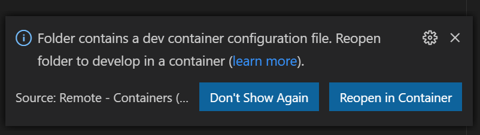

# workbench-server

The ecoacoustics workbench server. Manages the structure and metadata for environmental audio data. Provides an API for client access.

<small>(Previously known as baw-server)</small>


[](https://zenodo.org/badge/latestdoi/13489668)
[](https://hub.docker.com/repository/docker/qutecoacoustics/workbench-server/)

## Dependencies

This project's dev environment is managed by [Docker](https://www.docker.com/products/docker-desktop).
Please ensure the latest version of Docker Desktop is installed on your machine

Audio processing and other long-running tasks are performed using [baw-workers](./lib/gems/baw-workers).

## Contributing

We're working on that.

## Development requirements

Docker and docker-compose are required to run this application.

### Windows

Install:
- Optionally: At least Windows 10 Version 2004
- Docker desktop
  - a [recent version (>3.4) with Docker Compose V2](https://docs.docker.com/compose/cli-command/)!
- WSL Version 2 (and add a default Ubuntu distro): https://docs.microsoft.com/en-us/windows/wsl/install-win10
- Enable the `metadata` flag for DrvFS mounts: https://docs.microsoft.com/en-us/windows/wsl/wsl-config#configure-per-distro-launch-settings-with-wslconf
- If you have issue with bind mount permissions, boot the container as the root
  user and `chown -R 1000 .` to grant access to files

### MacOS

Install Docker Desktop

### Linux

Install docker as normal.

## Environment Setup

Clone this repo, then change directory to your cloned directory and on your **host** machine run

	$ docker-compose up

This will prepare a complete development environment. To see what is involved in
the setup, look at the  [`Dockerfile`](./Dockerfile) and [`bin/setup`](bin/setup) files.

You can `stop` the running containers using <kbd>ctrl+c</kbd> which is equivalent
to `docker compose stop`.

- `docker compose stop` will stop the containers
- `docker compose down` will stop containers, remove containers, and delete networks
    - images will not be deleted
    - the primary application state (on the postgres volume) will not be removed

**NOTE:** changes in the Dockerfile will not be reflected in docker compose images
or containers unless the compose project is destroyed or the containers are
rebuilt.

### Destroy or rebuild the docker environment

By default docker volume state is persisted between restarts of `docker compose`.
This means you can return to your previous development session easily. If,
however, you want to start from scratch you can remove state by doing one of
the following.

To start from scratch by **removing all containers, images, and volumes**:

    $ docker-compose down --remove-orphans --volumes --rmi local

To rebuild the `web` service / `baw-server` image (e.g. to update dependencies)
but keep state from our volume:

    $ docker-compose build


## IDE

We recommend using VSCode and VSCode's remote container development mode, with the included
workspace. When you open the [baw-server.code-workspace](./baw-server.code-workspace)
with vscode it should ask you to open the workspace dev container with a prompt similar to this:



## Development

If you're using VSCode's remote container development features you'll need to
start the web server. See the command below.

Otherwise, Start by running, on your **host** machine:

    $ docker-compose up


### Web server

For the following commands:

- if you're using VSCode's remote container feature you can run these commands
  in the built in terminal
- if you're entering these commands from your host
  - cd to this directory
  - prefix commands with `docker compose web exec` to run the commands once off
  - if the service isn't started, use `docker compose web start` to start it
  - use `docker compose web run xxx` to run the web service and then run command `xxx`
  - `docker compose exec web bash` to enter an interactive session

Common tasks that you may need:

- `bundle install` to install a new gem
- `rails db:xxx` to manipulate database
  - `rails db:setup` - does all of the below
  - `rails db:create` - create database
  - `rails db:migrate` - run migrations
  - `rails db:seed` - seed the database with default data
- `rails console` to use the rails console
- `rails start` to run a web server
- `passenger-config restart-app /` to restart passenger and hot-reload code
- `touch tmp/restart.txt` to trigger a passenger reload before every request

Note: the binstubs in the `bin` folder automatically load bundler. You should not
need to use `bundle exec`.

Docker commands:

- `docker compose stop` will stop the containers
- `docker compose stop web` stop web container so you can do something else
- `docker compose exec bundle exec passenger start` - the default action for `docker compose up`
- use `docker compose restart workers workers_test scheduler scheduler_test` to restart rails apps in headless services
  - this is useful for installing a new gem in associated containers after updating the Gemfile (entrypoint.sh does the `bundle install`)

When running the server in `development` or `test` modes, these configuration
files will be used:

- `config/settings/development.yml`
- `config/settings/test.yml`

They are based on `config/settings/default.yml`.

### Workers

- run commands on the worker container
  - e.g. `docker compose workers exec ...`
- list worker commands: `baw-workers -T` or `baw-workers` (using the manually maintained binstub)
- run a new worker: `baw-workers baw:worker:run`
- run a scheduler to process time-delayed tasks: `baw-workers baw:worker:run_scheduler`

Debugging:

Insert a `debugger` statement where you would like the debugger to stop. Alternatively you can enter
a break point after the debugger starts.


```shell
(host) > docker compose exec web bash
(container) > RAILS_ENV='test' rdbg --command -- /home/baw_web/baw-server/bin/rspec /home/baw_web/baw-server/spec/lib/modules/filter/query_spec.rb -e association
```

More information here: https://github.com/ruby/debug

### Tests

The tests are run using rspec:

    bin/rspec

Tests can also be run with a specified seed using rspec:

    rspec --seed <number>

There are some slower tests that do not always need to be run. These are marked
with the `slow` metadata and can be skipped with:

    rspec --tag ~slow

### Style

Use this style guide as a reference: https://github.com/rubocop-hq/ruby-style-guide.

## Documentation

Generate API documentation with:

  bin/generate_docs.sh

## Other commands

These commands should be executed automatically but are listed because they are helpful to know.

- Create the test database: `rails db:create RAILS_ENV=test`
- Then migrate and seed the test database: `rails db:migrate db:seed RAILS_ENV=test`
- Prepare the local development database: `rails db:setup RAILS_ENV=development`
- Run rspec tests: `rspec`
- Run rspec tests and generate a HTML report: `rspec --format html --out rspec_results.html`
- Generate API documentation: `bin/generate_docs.sh`

## Production setup and deploying

Create production settings file `config/settings/production.yml` based on `config/settings/default.yml`.
Create staging settings file `config/settings/staging.yml` based on `config/settings/default.yml`.

We deploy using Ansible.

If you want to use background workers, you'll need to set up [Redis](http://redis.io/).
A basic redis setup is included with the docker-compose file.

## Creating a release

1. `git switch master && git pull`
2. Set the GitHub auth token for docs generation:
    - `export CHANGELOG_GITHUB_TOKEN=xxx`
3. Determine the next version name. Check the ./VERSION file for the current version.
4. Run the `docker_build_and_push.ps1` script with the next version as the first argument:
    - e.g. ` ./docker_build_and_push.ps1 6.1.0`

## Architecture

- Two main parts
  - web server (Rails)
  - job workers (under lib/gems/baw-workers)
- docker compose is used to run
  - postgresql
  - redis
  - a single worker (for test and dev environments)
  -

## Credits

This project was originally created and maintained by [@cofiem](https://github.com/cofiem) - all the amazing things it does are a credit to them.

Other major credits go to:

- [@atruskie](https://github.com/atruskie)
- [@peichins](https://github.com/peichins)
- [@Allcharles](https://github.com/Allcharles)
- [@JessieLOliver](https://github.com/JessieLOliver) for design and user experience feedback

## Licence

Apache License, Version 2.0
