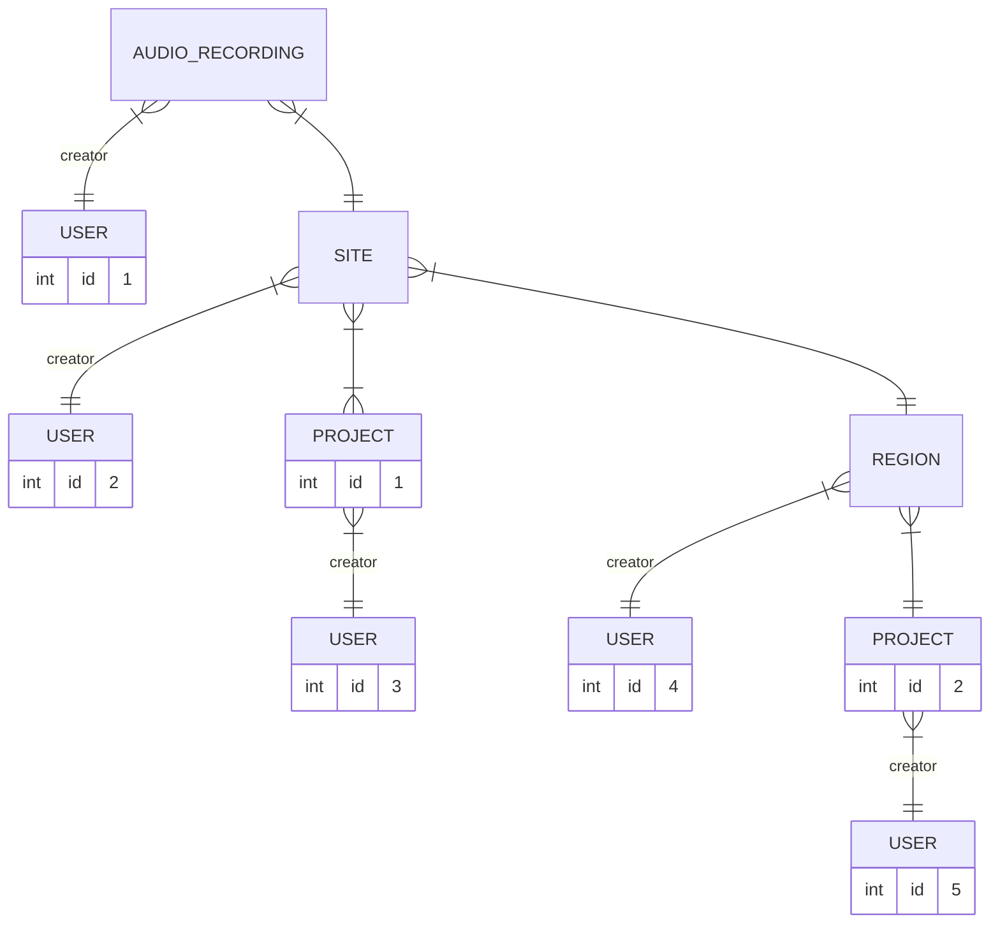
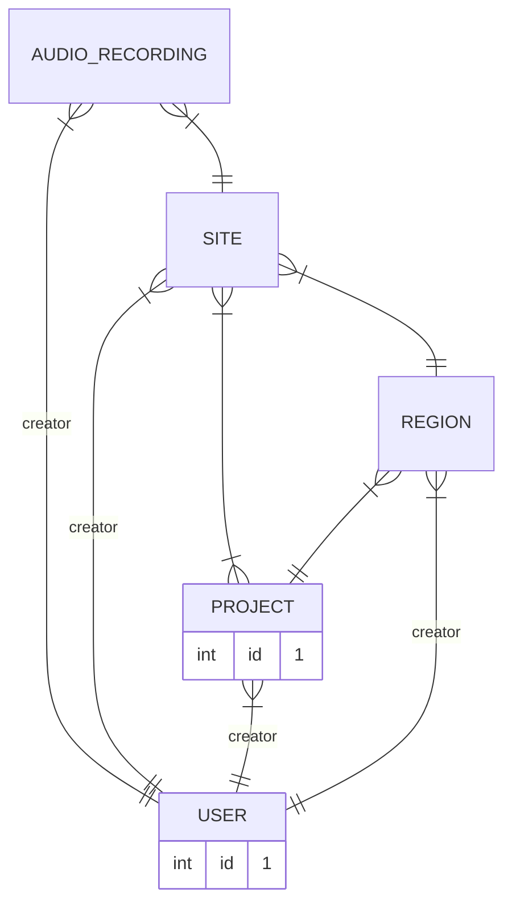

# Spec

Test types and folders are based on the conventional `Rspec` [directory
structure](https://rspec.info/features/7-0/rspec-rails/directory-structure/).

## API specs

Specs for the API are organised into different folders, based on separation of concerns:

- those that test permissions
    - modelled as request spec in the `spec/permissions` folder
- those that test capabilities
  - modelled as request spec in the `spec/capabilities` folder
- those that test specific functionality
  - modelled as request spec in the `spec/requests` folder
- those that document and validate the API
  - in the `/spec/api` folder

This separation also facilitates the use of different helpers and configurations
for each type of test (see the `spec/support` folder).

### Permissions

If the test is related to a permission, i.e. what user is allowed to invoke
which actions, it should be a permission spec (`spec/permissions`).

When testing permissions, the permissions helper methods will check that every
case of user and action combination is covered, and fail if not.

### API documentation and validation

If the test is related to the shape of the request or response, it should be an
api spec, and placed in the `/spec/api` folder. These tests document the API by
validating the request and response bodies according to the defined schemas[^1],
supported by the `rswag` gem. They are used to generate Swagger files that can
be exposed as YAML endpoints.

Note that all api specs are run as  the `admin_user`.

#### Unpermitted parameter error in API specs

If you encounter an unpermitted parameter error in your API specs, try checking that the 
correct `Content-Type` is being sent to the API.
The default content type for requests in the API is `application/json` but for requests
that don't expect a body you can set `consumes` in the API spec definition to `nil`. 

```ruby
get('download project audio events') do
  consumes nil
  produces 'text/csv'
  # ...
end
```

### Requests - Specific functionality

API tests that aren't covered by either the permissions or
documentation/validation categories (such as complex behaviours) can be a request
spec (`/spec/requests`).

## Git LFS

There are test fixtures that are tracked by Git LFS (Large File Storage). If Git
LFS files weren't downloaded successfully, they will appear as pointer files.
This can cause certain tests to fail. To fix this you can run the command `git
lfs pull`. 

### Deprecated tests

All tests in `spec/acceptance` are deprecated and should be replaced
when opportunities arrive.

## Factories

The `factory_bot` gem is used to create test data. Factories are defined in the
`spec/factories` folder.

`create_entire_hierarchy` is a helper method that creates a complete data
hierarchy, with all necessary associations (e.g. an audio recording that
belongs to a site that belongs to a region that belongs to a project).
It also makes a hierarchy that makes _sense_: all the relationships
are semantically correct, E.g. the same user is used to create many of the entities,
or multiple references to a project all reference the same parent project.

Watch out for standard factory bot factories. Each time a relation is needed, a
**new** instance of that entity is created. Entities created from previous
relation instantiations are generally **not reused**.

This results in explosive/exponential entity creations and slows down tests
considerably. This can be avoided by specifying a value for the relationship
upon creation:

```ruby
# this
create(:audio_recording, site: an_existing_site, creator: an_existing_user)
# instead of
create(:audio_recording)
```

...or by using the `create_entire_hierarchy` helper described above.

E.g. The items that will be created using the `audio_recording` factory with no
arguments:



Compared to the entities generarted by the `create_entire_hierarchy` helper that
are relevant to an `audio_recording`:



Run the `rake factory_bot:lint` task to lint factories.

[^1]: Refer to `app/modules/api/schema.rb` for the OpenAPI schema definitions;
    model-specific schemas are defined within their respective model classes.

